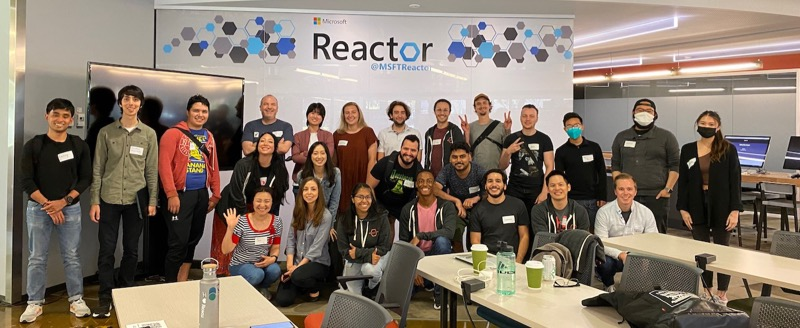

# Open source bootcamp

This repo contains a playbook and code designed to help you to run a 2-day open source bootcamp. This bootcamp is designed as an in-person event based off our experiences running similar events at the [Microsoft Reactor](http://developer.microsoft.com/reactor).

## Goal of the bootcamp

The goal of this bootcamp is to take attendees from a very basic to no understanding of GitHub on a journey to not only being comfortable with collaborating on GitHub, but being ready to actively contributing to public open source projects.

When we have run this event in the past (such as at the [In-person Student Open Source Bootcamp, at the Microsoft Reactor](https://www.meetup.com/microsoft-reactor-redmond/events/287024832/) and the [Hacktoberfest in-person open source bootcamp](https://www.meetup.com/microsoft-reactor-redmond/events/288635090/)), the attendees have all given feedback that networking is important, therefore this event includes opportunities for attendees to work together on code, be involved in networking activities and games together, and have time to talk over breakfast and lunch times.

### Intended audience

This event is targeted predominately at early in career developers, but would be of value to any developer who wants to get started with open source. This also includes students at Universities, High Schools, Colleges and Bootcamps who are learning to code.

This bootcamp leverages a JavaScript project to help attendees learn to make contributions, but the code is relatively simple, so anyone with a basic understanding of coding, including in different programming languages, should be able to benefit from this bootcamp.

## Run of the bootcamp

This bootcamp is designed to run as a 2-day in-person event:

* [Day 1 - Introducing Git and GitHub](./day1.md)
* [Day 2 - Get started with open source](./day2.md)

## How to run this event

Check out our [how to run this event guide](./how-to-run-this-event.md) for tips on organizing and running this event.

## Best practices

We have put together a [best practices guide](./best-practices.md) with tips to make this event as great as possible.

## Get in touch

If you are planning to run one of these events and have questions, please reach out in the [discussions tab](https://github.com/orgs/open-source-bootcamp/discussions).

If you have run the event and have feedback, either leave it in the [discussions tab](https://github.com/orgs/open-source-bootcamp/discussions), or raise and [issue](https://github.com/open-source-bootcamp/bootcamp-guide/issues).
