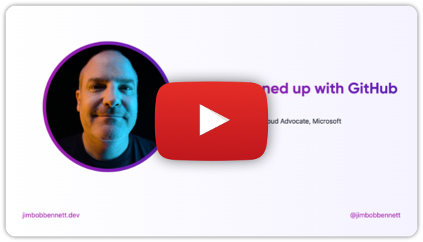
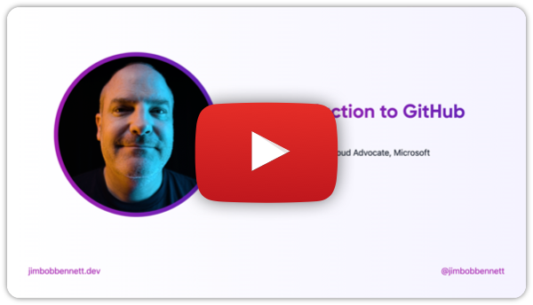

# Presentations

This folder contains the presentations needed to deliver this bootcamp.

Each subfolder contains the content for the presentation, including all slides in a file called `slides.md`. This markdown file contains the slides in the required format for [Sli.Dev](https://sli.dev), a tool for presenting slides inside your browser. Below you can also find videos of some of the sessions to help the speaker learn the content.

> The slides look best in Edge or Chrome. The rendering in Safari looks a little wonky with outlines around some titles.

## Personalizing the slides

Each slide markdown file has a first slide to introduce the speaker. You will need to set a number of fields in the front matter and the first slide to match the presenter:

* Set the value for the `website` field to the presenters website (for example your GitHub page) if you want a link on every page.
* Set the value for the `handle` field to the presenters social handle (for example your Twitter handle) if you want this on every page
* Set the value of the `logoHeader` to an image file for the presenter or the presenters companies logo if you want this on every page
* Replace `Name` and `Job title/company/other details` in the first slide with the presenters name and other details.
* Set the `introImage` value with a link to an image of the presenter
* Add any extra introductions as needed - for example adding your open source origin story showing how you got into contributing to open source
* The **Welcome** slide deck needs more customization. See the [`README.md` file in the `welcome` folder](./welcome/README.md) for more details.

## Using the slides

To use the slides:

1. Clone this repo

1. From the `presentations` directory run the following command to install Sli.Dev:

    ```bash
    npm install
    ```

1. Launch the presentations using one of the provided scripts:

    **Day 1**

    | Slides                                       | Script                   |
    | -------------------------------------------- | ------------------------ |
    | Welcome                                      | `npm run welcome`        |
    | Sign Up for GitHub                           | `npm run signup`         |
    | Intro to GitHub                              | `npm run intro`          |
    | Make your first contribution to open source  | `npm run first-contrib`  |
    | Make your second contribution to open source | `npm run second-contrib` |
    | Day 1 wap up                                 | `npm run wrap1`          |

    **Day 2**

    | Slides                            | Script                 |
    | --------------------------------- | ---------------------- |
    | Licensing, CLAs and Contributions | `npm run licensing`    |
    | Team Contributions                | `npm run team-contrib` |
    | Day 2 wap up                      | `npm run wrap2`        |

2. This will launch Sli.Dev on your local host at port 3030. You can open the slide deck at [localhost:3030](http://localhost:3030).

3. If you want to access speaker notes, you can get to these from [localhost:3030/presenter](http://localhost:3030/presenter/). This presenter view will allow you to control the slide deck, see the current and next slide, see the speaker notes, and annotate the slide if required. The speaker notes are included as HTML comments in the markdown in the `slide.md` files.

> This repo is designed to work with development containers inside VS Code. If you open this repo in the dev container in VS Code, Sli.Dev will be automatically installed in the container, so you just need to run the relevant `run` command to launch the presentation. You will need Docker or other Docker CLI compliant container engine running to open the development container. You can read more on development containers in the [VS Code Developing inside a container documentation](https://code.visualstudio.com/docs/devcontainers/containers).
>
> The relevant port will be forwarded from the container, so you can still open the slides from [localhost:3030](http://localhost:3030).

## List of presentations

### Day 1

* [Welcome](./welcome/)

    This is an example deck for welcoming attendees to this event. It includes an example code of conduct, example mentor and speaker introductions, and a sample run of both days of the event. You can find details on customizing this deck in the [Welcome slide deck README](./welcome/README.md).

* [Get signed up for GitHub](./get-signed-up-with-github/)

    Select the image below for a video of this session.

    [](https://youtu.be/tYZjLRc4GlA)

    This includes a slide for the GitHub student developer pack. If your audience does not include students then remove this slide. Instructions to do this are inline in the `slides.md` file.

* [Introduction to GitHub](./intro-to-github/)

    Select the image below for a video of this session.

    [](https://youtu.be/uv5qw3kfbQs)

    These slides have embedded YouTube videos. You will need to ensure you are presenting in a way that the audience can hear the audio from your computer. If not, you **MUST** turn on captions on the videos. Ideally captions should always be turned on.

    There is also an image of a GitHub profile taken from [@JimBobBennett](https://github.com/JimBobBennett). Replace this with an equivalent screenshot of your own GitHub profile.

* [Day 1 wrap up](./day-1-wrap/)

    This deck wraps up day 1. You will need to make any relevant changes to call out any specific activities that took place on day 1, and optionally to thank mentors, speakers and event staff in person. You will also need to update any information about the second day, such as the start time.

### Day 2

* [Contributions, CLAs, and License agreements](./contributions-licensing/)

* [Day 2 wrap up](./day-1-wrap/)

    This deck wraps up the entire event. You will need to make any relevant changes to call out any specific activities that took place over this event, and optionally to thank mentors, speakers and event staff in person.

## FAQ

* **Why aren't these slides hosted somewhere so I don't need to clone this repo**

    Great question! We wanted to allow you to add your personal details like name, social handle, image etc. The easiest way to do this is for you to run these slides locally

* **Once customized with my details can I host my slides anywhere**

    Yes! Navigate to the folder containing the presentation you want to host, then run:

    ```bash
    npx slidev build
    ```

    This will build a single page application (SPA) in a subfolder called `dist` that you can host with services like [GitHub pages](https://pages.github.com) or [Netlify](https://www.netlify.com).

    You can read more in the [Sli.Dev Static Hosting documentation](https://sli.dev/guide/hosting.html).
