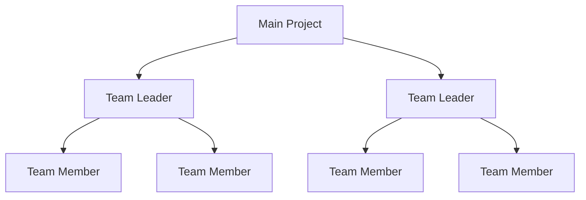
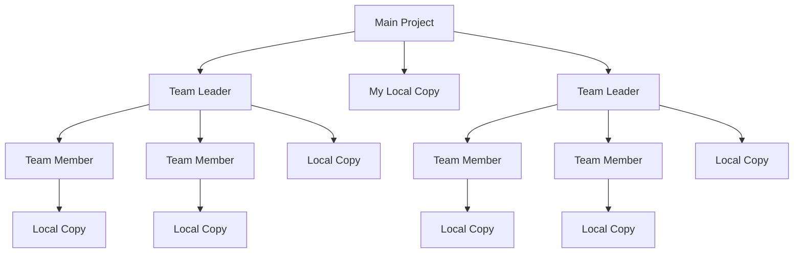
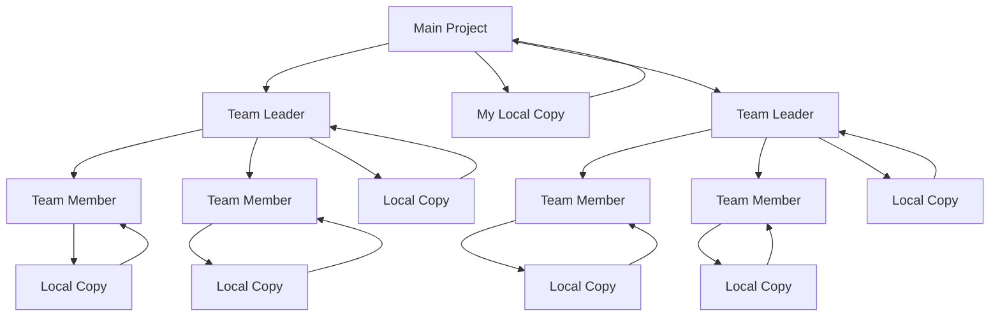
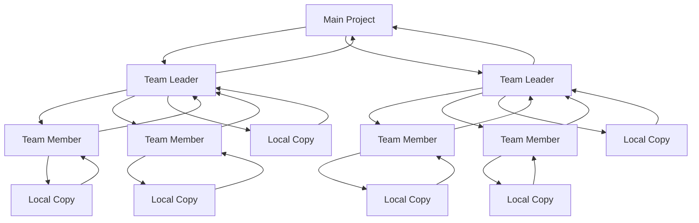

# Contributing to Open Source

### Name

Job title/company/other details

<!-- 
Hi, I am name.

This is an introduction that will walk you through your first contribution to a GitHub Project: Flappy Cube!

Over the course of this session we're going to walk through how to start contributing to a public open source project with your peers.

-->

---

# Other Peoples Code

todo: just like github lets you manage your own code, you can also browse other peoples code

---

# Types of Contributions

* Pull Requests - Submitting Changes
* Opening Issues - Suggesting Features, Discussing Changes
* Creating Documentation - Writing Documentation, Videos and More
* Joining the Community - Meetups, Conferences and Online Communities

---

# Flappy Cube

todo: Now lets talk about the project we're going to be starting with

---

# Form Groups

Time to find some new friends and elect a leader!

---

# What Are Forks

Have the group leader create a fork

---

# A Fork in the Road

Group leader clone the main repo
Among your group, have the leader share the link to their fork of the project
Everyone else clone the leaders project

---

# The Tree of Contributions

Overview of what things look like

---

# Clone Your Project

For local editing we need a local copy

Note that this is optional

---

# Now We're Here

---

# Branching Off

We create branches to allow us to work in multiple workstreams

Changes you make locally are only pushed to the remote repository when you tell it to!

---

# Create a New Development Branch

Create a branch to work in and check it out.

todo: for these steps show CLI and VS Code steps side by side

---

# Making a Change

Live Demo: show the file we're going to update.

---

# Committing to the Bit

Changes are stored in commits, commit your changes locally

---

# Pushing Changes

You are working *locally*. Your changes are not available online. To make that possible we need to commit our changes.

---

# Lets Get Your Changes Online

Live Demo: show the push up to your local copy.

---

# Here's Where We Stand

---

# Lets Talk About Merge Conflicts

We just created a bunch of them...

😥

---

# Independant Changes

We all made changes to the same file, and the same line.

All of our files are different now, how do we know what is right?

Change conflicts prevent you from making changes to a file that has changes *newer* than the file you were working on.

You can force your changes, but that risks overwriting other peoples work.

---

# Pull Requests

Pull Requests are how we ask for permission to merge code into another persons repository.

This is how you contribute to source code you do not own.

---

# Code Reviews

Repository owners can review and comment on your changes.

Most projects require some number of automated tests or validation to pass before you can merge your changes.

---

# Lets Create PRs for Your Code

Live Demo: Create a PR against the project, get a review from a mentor, merge.

Everyone but the team leader should open a PR against their leaders repository. Somebody else on the team should review it. Team leader should merge them.

Once everyone else on your team has their code in your leaders repository, create a pull request from that repository to the main project.

You will have to address merge conflicts during this, ask mentors if you get stuck.

---

# Everything Is Merged

The renderer gets a bit mixed up here. How are you all doing?

---
layout: new-section
---

# And Now For Something Different

Alright. Not that different.

---

# Issues

Issues let us communicate intent about a project and are a backlog of available work.

You can tag your work to issues by using the issue number.

ex: `#24`

---

# Contribute a New Feature

Pick an issue and work with your team to contribute an implementation of the issue.

Be sure you tag the issue when opening up your pull request against the project.