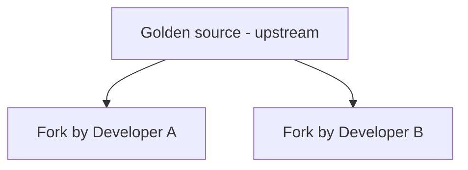
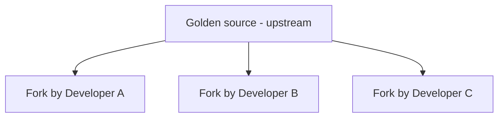
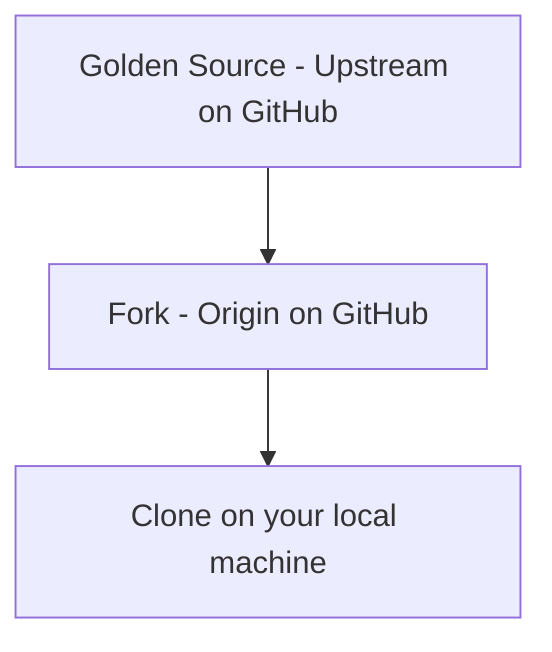

# Make your first contribution to an Open Source project

### Name

Job/title

<!-- 
Hi, I am name.

This is an introduction that will walk you through your first contribution to a GitHub Project: Flappy Cube!

Over the course of this session we're going to walk through how to start contributing to a public open source project with your peers.

This will be hands on, with plenty of time for you to complete each section. Mentors are here to help, so if you get stuck let a mentor know!

-->

---

# What is the most important skill you can have as a developer?

<!--

This is actually one of the most important skills for any job, if not life.

The ability to collaborate with others. Software development is a team sport, and for the team to be effective you need
to be able to collaborate.

-->


---

# GitHub is a place to collaborate

Over the next 2 hours you will use GitHub in teams to collaborate on some software changes to Cube Flyer

<!--

The goal if this afternoon is to show you how you can collaborate on code using GitHub. Open source development is all about collaboration - many developers from all around the world collaborate on software using tools like GitHub

-->

---
layout: image-center
image: 'https://github.com/open-source-bootcamp/bootcamp-guide/raw/main/presentations/make-your-first-contribution/cube-flyer.gif'
image-width: '500'
---

# Cube Flyer

<!--

Cube flyer is a simple but very hard game. The idea is to fly your cube through random gaps in barriers, and not hit a barrier, the floor or the ceiling.

You only need 1 button to play!

Your tasks today involve adding features to this game

-->

---
layout: center
---

# Form small teams

<!--
Form teams of up to 4 people. You will be working in teams, similar to how development teams work
-->

---
layout: center
---

# Pick a project owner

<!--
The project owner will own the golder source version of the code, and the rest of the team will make contributions to the owners code base
-->

---


# Why a project owner?

- Git is a _distributed version control system_, each person has a full copy of the code and all history
- Being distributed, anyone can send code to anyone
- So who releases the code?

---

# You need a 'golden source' version

- You need a single place to release from to ensure that all changes make it to a release
- The GitHub way is to have a golden source repo owned by an organization, and developers 'fork' code

<!--

When we release a new version of Cube Flyer, we want to ensure we have everyone's changes. So we need a golden source for everyone to send their changes to.

The GitHub way is the organization owns the golden source repo, and developers fork the code. We will cover forks in a minute.

The project owner here will act like an organization and 'own' the golden source of the code

-->

---

# The golden source

The golden source will be a new repo that the project owner will create that contains the Cube Flyer code.

We have a 'template repo' you can use to create this.

<!--

To make it easier to create the golden source repo with the cube flyer game, we have created a template to automate this.

This is essentially a repo that you use to pre-fill code and other files into a new repo

-->


---

# Project owners only - create the golden source

Create a new repo using the Cube Flyer template

---
layout: center
image: 'https://github.com/open-source-bootcamp/bootcamp-guide/raw/main/presentations/make-your-first-contribution/qrcode-cube-flyer.png'
image-width: '300'
---

# github.com/open-source-bootcamp/CubeFlyer


<!--

Project owners only - if you are not a project owner, you don't need to do this step. You will get your code later.

-->

---
layout: image-center
image: 'https://github.com/open-source-bootcamp/bootcamp-guide/raw/main/presentations/make-your-first-contribution/create-new-repo-from-template.png'
image-width: '800'
---
&nbsp;
<!--

From the repo, select the **Use this template** button, then select create a new repository. This will create you a brand new repository

-->

---
layout: image-center
image: 'https://github.com/open-source-bootcamp/bootcamp-guide/raw/main/presentations/make-your-first-contribution/create-new-repo-details.png'
image-width: '530'
---
&nbsp;
<!--

Name your new repo, and set it to public

The public part is important!!!!!

-->

---
layout: image-center
image: 'https://github.com/open-source-bootcamp/bootcamp-guide/raw/main/presentations/make-your-first-contribution/repo-from-template.png'
image-width: '680'
---
&nbsp;
<!--

We now have our golden source. You can think of this as an open source project you might want to contribute to.

-->

---

# Contributing to a project

GitHub has _Issues_, a way to track work to be done, such as bugs or new features.

If you want to contribute to an open source project, you would usually start by finding an issue to work on.

<!--

Issues are GitHubs way of tracking work. You raise an issue with a description of the work, and anyone involved can add comments to discuss the issue.

Issues can be linked to a pull request, so once the PR is merged, the issue is closed.

We've set up the CubeFlyer repo to automatically create 5 issues, and we are going to work on the first one now. Only the 'product owner' with the golden source repo will see issues, these are not in the forks.

-->

---

# Standard workflow

- Issues are raised in the upstream, golden source repo
- To work on an issue, a developer forks the repo
- The developer clones the repo and works on the issue, pushing code back to their fork
- A pull request is raised to merge from the fork back into the upstream repo

<!--

This is a pretty standard workflow, and what we are going to do here. We'll cover these new terms, fork and clone in a minute.

-->

---
layout: image-center
image: 'https://github.com/open-source-bootcamp/bootcamp-guide/raw/main/presentations/make-your-first-contribution/issue-add-more-greetings.png'
image-width: '800'
---

# Issue - add more greetings

This is the first issue for CubeFlyer, and the one we are going to work on.

<!--

Select the issue Add more greetings from the issue tab.

For tracking, you can assign an issue to a developer to work on. For this workshop, we are all going to work on the issue.

-->

---

# Forks

A fork is a complete copy of the code, including all history, that knows about the golden source repo.

When you fork a repo, the 'golden source' is referred to as the _upstream_.


<!--

When you 'fork' a repository, you create a new repository that you onw that is a complete copy of the original, with all the code and history.

The fork knows about where it was forked from. The repo it was forked from is often referred to as the upstream.

When you make changes to the fork, you only change the fork, NOT the upstream. 

Forks can be forked.

-->

---


&nbsp;
<!--

You can have as many forks as you like!
Forks have the same access rights as the golden source. Organizations will keep code secret in a private repo, and any forks are also kept private, with the organization managing the access.

For example, if I fork a private <my employer> repo, I can't then make my fork public.

-->

---

# Forking a repo

You fork a repo using the **Fork** button


---
layout: image-center
image: 'https://github.com/open-source-bootcamp/bootcamp-guide/raw/main/presentations/make-your-first-contribution/create-fork-details.png'
image-width: '600'
---

---

# The team needs to fork the project owner's repo

- Project owners - share the repo URL with the team
- Team members - create a fork of the repo

---


&nbsp;
<!--

This is what we have - one golden source, one fork per team member.

Each fork is it's own repo, and you can make your changes to it.

When you change the clone, it only updates the clone.

-->

---

# Cloning repos

Repositories can be cloned - that is creating a copy on your local machine

A clone is like a fork - but instead of being stored in GitHub, it's on your local machine. The repository you are cloning from is known as the _origin_.

This morning we edited code online in GitHub. This is not the normal way to edit code. The 'normal' way to edit code is locally. You download a copy of the code to edit.

<!--

Cloning is the process of taking a local copy of the code from a GitHub repo

-->

---


&nbsp;
<!--

Each block in this diagram is a complete repository, with all the code and history 

-->

---
layout: image-center
image: 'https://github.com/open-source-bootcamp/bootcamp-guide/raw/main/presentations/make-your-first-contribution/clone-with-desktop.png'
image-width: '550'
---

# Clone the repo

<!--

From your own form (NOT the upstream), select the **Code** button, make sure the local tab is selected, then select **Open with GitHub desktop**

You can clone using the `git` command line, using the GitHub CLI, or directly in tools like Visual Studio Code, but we are going to use GitHub desktop

-->

---
layout: image-center
image: 'https://github.com/open-source-bootcamp/bootcamp-guide/raw/main/presentations/make-your-first-contribution/github-desktop-clone.png'
image-width: '500'
---
&nbsp;
<!--

Set the local path, and select **Clone**. This will create a local Git repository with all the code and history from your repo

-->

---
layout: image-center
image: 'https://github.com/open-source-bootcamp/bootcamp-guide/raw/main/presentations/make-your-first-contribution/github-desktop-open-in-vscode.png'
image-width: '500'
---

# Open the code

<!--

Now you have the code, open it in VS Code. There should be an option on the main window, or use the *Repository* menu

-->

---
layout: image-center
image: 'https://github.com/open-source-bootcamp/bootcamp-guide/raw/main/presentations/make-your-first-contribution/vscode-first-open-with-code.png'
image-width: '600'
---

&nbsp;

---
layout: image-center
image: 'https://github.com/open-source-bootcamp/bootcamp-guide/raw/main/presentations/make-your-first-contribution/cube-flyer.gif'
image-width: '500'
---

# Play the game!

Cube Flyer is a self-contained, static web app, you open the _game/index.html_ file in a browser and play.

<!--

Find the index.html file and open it. From VS Code you can reveal in Explorer/Finder then open in a browser.
Or right-click, show preview to get it running in VS Code.

Press any key to start the game, then use the space bar or left mouse button to go up. Gravity brings you back down.

-->

---
layout: image-center
image: 'https://github.com/open-source-bootcamp/bootcamp-guide/raw/main/presentations/make-your-first-contribution/flying-cube-greeting.png'
image-width: '600'
---
# The greeting

Greetings are randomly chosen from a list. Refresh the page to change the greeting.
<!--

This is the greeting - It's a bird! These are randomly chosen from a hard-coded list of greetings.

Refresh to see different ones

-->
---
layout: image-center
image: 'https://github.com/open-source-bootcamp/bootcamp-guide/raw/main/presentations/make-your-first-contribution/greetings-code.png'
image-width: '580'
---

# game/src/constants.js

<!--

The greetings are defined in the `game/src/constants.js` file

-->

---

```javascript
const greetings = [
    'It\'s a bird!',
    'It\'s a plane!',
    '1000% more Cube!',
    'A Whole New Dimension!'
];
```

<!--

These are defined in a JavaScript array - don't worry if you are not a JavaScript developer, the syntax should make sense if you have written any code.

Each greeting is a string in single quotes, in an array. Commas separate each array item, and square braces define the array.

Because each item is in single quotes, to use a single quote in the string, such as in it's, you escape it with a \, basically the \ tells the code that it is an apostrophe, not a closing quote.

-->

---

# Add a new greeting of your choice

```javascript
const greetings = [
    'It\'s a bird!',
    'It\'s a plane!',
    '1000% more Cube!',
    'A Whole New Dimension!',
    'Hello world!'
];
```

<!--

Everyone should add a greeting of their choice to the end. Remember to add a comma after the line above.
Once done, test our your code to see the new greeting - you may have to refresh a few times.

-->

---

# Add a new greeting of your choice

```javascript {5-6}
const greetings = [
    'It\'s a bird!',
    'It\'s a plane!',
    '1000% more Cube!',
    'A Whole New Dimension!',
    'Hello world!'
];
```

<!--

Everyone should add a greeting of their choice to the end. Remember to add a comma after the line above.
Once done, test our your code to see the new greeting - you may have to refresh a few times.

-->
---
layout: image-center
image: 'https://github.com/open-source-bootcamp/bootcamp-guide/raw/main/presentations/make-your-first-contribution/flying-cube-greeting-hello-world.png'
image-width: '600'
---

# Test out the new greeting

You may need to refresh the page a few times to see it.

<!--

Our new greeting!

-->

---

# Now the code change is done, we need to commit it!

We have a local change, so first we need to commit it to our local copy

<!--

If you remember from this morning, we made a change then committed it. We need to commit to our local clone

-->

---
layout: image-center
image: 'https://github.com/open-source-bootcamp/bootcamp-guide/raw/main/presentations/make-your-first-contribution/code-source-control-tab.png'
image-width: '500'
---

# VS Code Source Control tab

You can commit from the VS Code Source Control tab

<!--

Select the Source Control tab, add a description, then select Commit. If it says you have no staged changes and asks if you want to commit all changes, select yes.

Once you make this change, it is only local. If you look at your fork on GitHub, you won't see the change.

-->

---
layout: image-center
image: 'https://github.com/open-source-bootcamp/bootcamp-guide/raw/main/presentations/make-your-first-contribution/code-source-control-tab-sync-changes.png'
image-width: '500'
---

# Sync changes to your fork

<!--

Use the Sync button to sync your changes to your fork. You will now be able to see these on GitHub

-->

---
layout: image-center
image: 'https://github.com/open-source-bootcamp/bootcamp-guide/raw/main/presentations/make-your-first-contribution/github-commit-ahead-of-main.png'
image-width: '800'
---

&nbsp;

<!--

If you look at your fork in GitHub, you will see you are 1 commit ahead of the upstream repo.

-->

---
layout: image-center
image: 'https://github.com/open-source-bootcamp/bootcamp-guide/raw/main/presentations/make-your-first-contribution/github-commit-ahead-of-main-hover.png'
image-width: '800'
---

# Raise a Pull Request

You can now raise a pull request to merge from your fork to upstream

<!--

You can raise a PR by clicking on the _1 commit ahead_ message on your fork. This shows you the changes and allows you to raise a PR.

-->

---
layout: image-center
image: 'https://github.com/open-source-bootcamp/bootcamp-guide/raw/main/presentations/make-your-first-contribution/changes.png'
image-width: '680'
---
&nbsp;
<!--

This page shows the differences, including what is being compared. In this case the difference between the fork and upstream
Select the **Create Pull request** button to create a pull request

-->

---
layout: image-center
image: 'https://github.com/open-source-bootcamp/bootcamp-guide/raw/main/presentations/make-your-first-contribution/create-pr.png'
image-width: '680'
---
&nbsp;
<!--

Fill in the pull request details to create the PR, then create it. You can use # to refer to issues and other Pull requests. In this case we are referring to issue #1, the add more greetings issue.

This is helpful to explain what the PR is for.

-->

---
layout: image-center
image: 'https://github.com/open-source-bootcamp/bootcamp-guide/raw/main/presentations/make-your-first-contribution/pr.png'
image-width: '680'
---
&nbsp;
<!--

From the upstream repo, you will be able to see the PR in the Pull requests tab

-->

---

# Review and merge the pull request

A pull request is a way of asking the golden source repo to pull your changes.

Before a pull request is merged, it is normal for one or more people to do a _code review_ to check your changes.

Things to review here:

- Is the greeting in single quotes?
- If the greeting contains an apostrophe or single quotes, are these escaped?
- Is the array correctly formatted, with a comma after the previous item?

<!--

A pull request is an opportunity for a code review. This is where other developers on the team will review your code.
This is a conversation where additional changes can be requested, questions can be asked, and other developers on the team can learn about the code change.
By having the issue in the description or conversation, the reviewer can quickly check what the intent of the change was.

Make sure you review the code!

You can also test a pull request. Each pull request is like a branch, so you can use the branch to test the PR code by switching to the PR branch.
We're not going to do this today. To test get the developer to show you their code running.

-->

---
layout: image-center
image: 'https://github.com/open-source-bootcamp/bootcamp-guide/raw/main/presentations/make-your-first-contribution/pr-comment.png'
image-width: '580'
---
&nbsp;

<!--

The _Conversation_ tab shows PR details such as commits, comments and more. This is the place for general conversation around the PR - such as 'have you tested scenario X', 'what does this code do?'.

Project owners - add a comment to the first pull request.

-->

---
layout: image-center
image: 'https://github.com/open-source-bootcamp/bootcamp-guide/raw/main/presentations/make-your-first-contribution/pr-review-file-comments.png'
image-width: '800'
---
&nbsp;

<!--

The _Files changed_ tab shows the actual changes to a file. Here you can add comments against lines of code, suggest changes, and start a review.
A review is a way of listing one or more changes or questions that need to be addressed. This makes it easier for the developer to know what they have to do.

-->

---

# Project owners - merge the first PR!

Once you are happy with the change, merge that first PR.

<!--

To merge, click merge pull request, then confirm merge. This is the same as you did earlier with branches.

-->

---

# Project owners - merge the second PR

Should be easy, right?

<!--

Once one PR is merges, the next one should be merged the same way. Easy right?

Nope - we've intentionally added something that will make it hard

-->

---
layout: image-center
image: 'https://github.com/open-source-bootcamp/bootcamp-guide/raw/main/presentations/make-your-first-contribution/merge-conflict-greeting.png'
image-width: '800'
---

# Merge conflict

GitHub tracks changes to files. A merge conflict is when 2 or more developers want to make changes to the same code in the same file and these changes conflict

<!--

A merge conflict is when multiple changes conflict with each other. You can't merge these changes until Git knows what to do to resolve this.
You can fix these either locally, or as a part of the pull request.

-->

---
layout: image-center
image: 'https://github.com/open-source-bootcamp/bootcamp-guide/raw/main/presentations/make-your-first-contribution/one-commit-ahead-one-behind.png'
image-width: '800'
---

# Managing merge conflicts before raising a PR

<!--

You will see your repo showing how many commits ahead and behind you are. In this case the repo is one commit ahead (the greeting change on the fork), and one behind (the greeting change upstream)

-->

---
layout: image-center
image: 'https://github.com/open-source-bootcamp/bootcamp-guide/raw/main/presentations/make-your-first-contribution/github-desktop-update-branch.png'
image-width: '600'
---

# Fix the merge conflict

1. From GitHub desktop select _Update from upstream/main_ from the _Branch_ menu

    This will pull the changes from the upstream repo

<!--

To fix the merge conflict, first you need both sets of changes. You can then decide what to keep.

-->

---
layout: image-center
image: 'https://github.com/open-source-bootcamp/bootcamp-guide/raw/main/presentations/make-your-first-contribution/github-desktop-merge-conflict-dialog.png'
image-width: '400'
---

# Fix the merge conflict

2. You will get a warning about the merge conflict

    Select **Open in Visual Studio Code** to edit the merge conflict

<!--

You can resolve merge conflicts in VS Code

-->

---

# Fix the merge conflict

3. Make the required code changes

```javascript
const greetings = [
    'It\'s a bird!',
    'It\'s a plane!',
    '1000% more Cube!',
    'A Whole New Dimension!',
<<<<<<< HEAD
    'Cubetastic!'
=======
    'Hello world!'
>>>>>>> upstream/main
];
```

<!--

This shows the changes between the < and > lines

-->

---

# Fix the merge conflict

3. Make the required code changes

```javascript {6-10}
const greetings = [
    'It\'s a bird!',
    'It\'s a plane!',
    '1000% more Cube!',
    'A Whole New Dimension!',
<<<<<<< HEAD
    'Cubetastic!'
=======
    'Hello world!'
>>>>>>> upstream/main
];
```

<!--

From the HEAD to the line of equals is your changes. From the line of equals to the upstream/main is the changes already on the fork.
You need to edit the code to something you are happy with, then remove the <, > and = lines.

Edit the code to have both changes without the merge conflict lines, and be sure to add a comma after the second to last line

-->

---

# Fix the merge conflict

3. Make the required code changes

```javascript {6-7}
const greetings = [
    'It\'s a bird!',
    'It\'s a plane!',
    '1000% more Cube!',
    'A Whole New Dimension!',
    'Cubetastic!',
    'Hello world!'
];
```

---
layout: image-center
image: 'https://github.com/open-source-bootcamp/bootcamp-guide/raw/main/presentations/make-your-first-contribution/github-desktop-merge-conflict-dialog-continue-merge.png'
image-width: '400'
---

# Fix the merge conflict

4. Continue the merge

    Continue the merge in GitHub desktop, then sync your changes in VS Code.

<!--

Once the changes are made, go back to GitHub desktop and you will see there are no conflicts remaining. You can now continue the merge.
Once merged, sync your changes in VS Code and raise a Pull Request.

-->

---
layout: image-center
image: 'https://github.com/open-source-bootcamp/bootcamp-guide/raw/main/presentations/make-your-first-contribution/pr-with-merge-conflicts.png'
image-width: '500'
---


# Managing merge conflicts after raising a PR

<!--

If you raise a PR that has conflicts (either conflicts when you raise it, or conflicts because another PR was merged first), then you need to resolve these before you can merge the PR.

-->

---
layout: image-center
image: 'https://github.com/open-source-bootcamp/bootcamp-guide/raw/main/presentations/make-your-first-contribution/github-merge-editor.png'
image-width: '700'
---

# Fix the merge conflict

1. Click the Resolve conflicts button to get a web editor to change the file.

    This will open the merge conflict in a web editor
<!--

Click the Resolve conflicts button to get a web editor to change the file

-->

---
layout: image-center
image: 'https://github.com/open-source-bootcamp/bootcamp-guide/raw/main/presentations/make-your-first-contribution/github-merge-editor-code-fixed.png'
image-width: '700'
---

# Fix the merge conflict

2. Fix the code!

    Make the same changes described earlier - remove the merge markers and ensure the code has a comma after the second to last item
<!--

Click the Resolve conflicts button to get a web editor to change the file

-->

---
layout: image-center
image: 'https://github.com/open-source-bootcamp/bootcamp-guide/raw/main/presentations/make-your-first-contribution/github-merge-editor-code-marked-as-resolved.png'
image-width: '700'
---

# Fix the merge conflict

3. Mark the code as resolved

    Click the **Mark as resolved** button to indicate you have resolved the merge conflict

<!--

Click the mark as resolved button to indicate the merge conflict is resolved.

-->

---
layout: image-center
image: 'https://github.com/open-source-bootcamp/bootcamp-guide/raw/main/presentations/make-your-first-contribution/github-merge-editor-merge-dialog.png'
image-width: '600'
---

# Fix the merge conflict

3. Commit the merge to the _main_ branch

    Click the **Commit merge** button to commit the merge, then confirm you want to update _main_.

<!--

Commit merge will create a commit on your branch bringing in the changes from upstream so you can successfully raise the PR

-->

---
layout: image-center
image: 'https://github.com/open-source-bootcamp/bootcamp-guide/raw/main/presentations/make-your-first-contribution/pr-comment-merge-conflict-resolved.png'
image-width: '600'
---

# Fix the merge conflict

4. Merge the PR

    The PR is now ready to merge. You will see a new commit on the conversation tab showing the merge from upstream.

<!--

Commit merge will create a commit on your branch bringing in the changes from upstream so you can successfully raise the PR

-->

---
layout: center
---

# Now merge away!

<!--

Merge all the PRs from your team, fixing conflicts as you go.

Merge conflicts don't happen that often as it is rare you'd have multiple developers working on the same code base, but we wanted to cover these as they do pop up and can be very confusing.

-->

---
layout: image-center
image: 'https://github.com/open-source-bootcamp/bootcamp-guide/raw/main/presentations/make-your-first-contribution/github-issue-comment.png'
image-width: '600'
---

# Close the issue

Once you are done with adding greetings, you can close the issue, ideally with a comment.

<!--

Once an issue is resolved, the project owner can close it. Ideally you should add comments explaining what was done. You can link PRs or other issues using # then the number
The issue will be marked as closed and will be hidden from the default issues tab. You can find it by changing the issues tab filters.

-->

---

# Done!

You have made your first contribution to a project!

<!--

In this session we've shown you how to make a contribution to another project. You've learned how to fork code, make changes, raise pull requests upstream, and resolve merge conflicts.

We've also looked at issues.

-->


