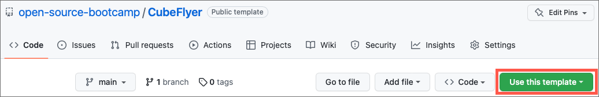
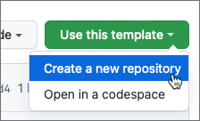
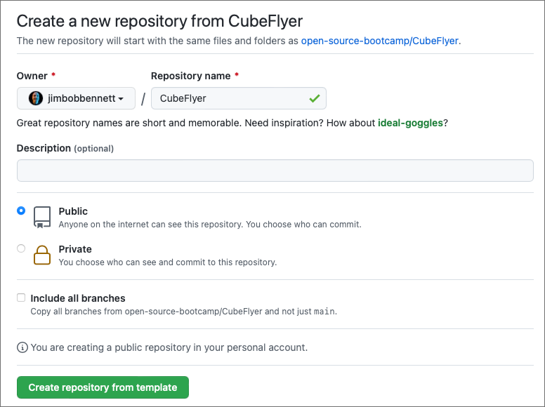
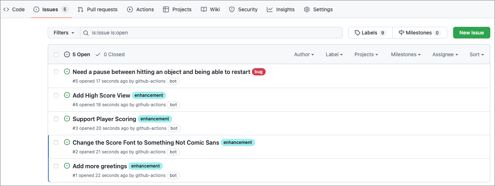
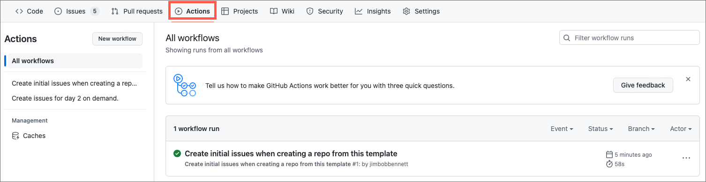
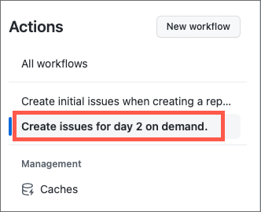
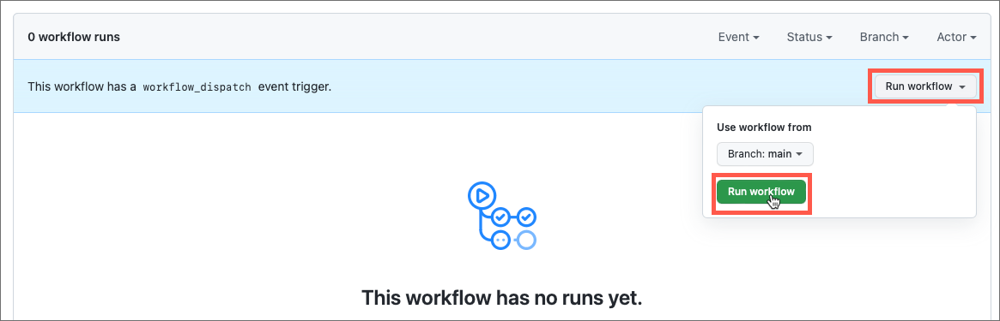
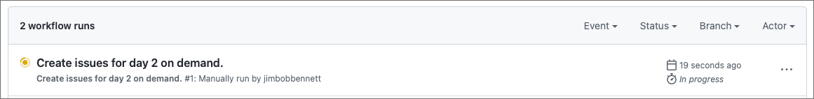
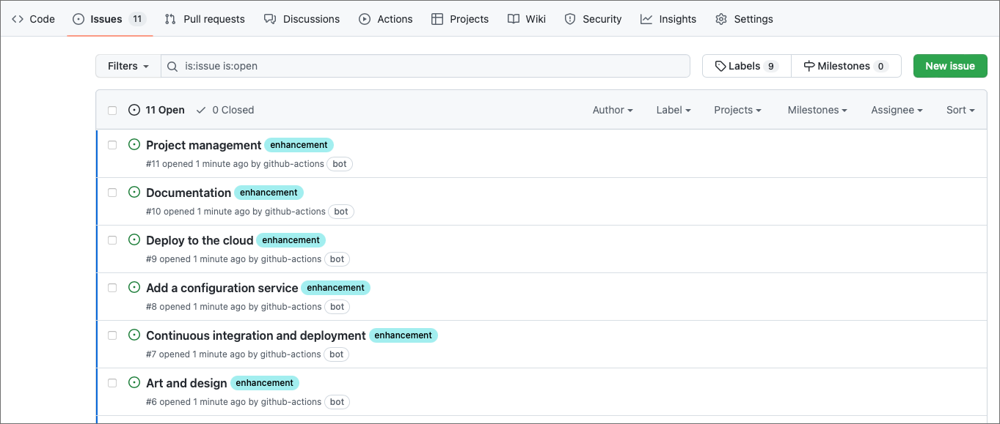
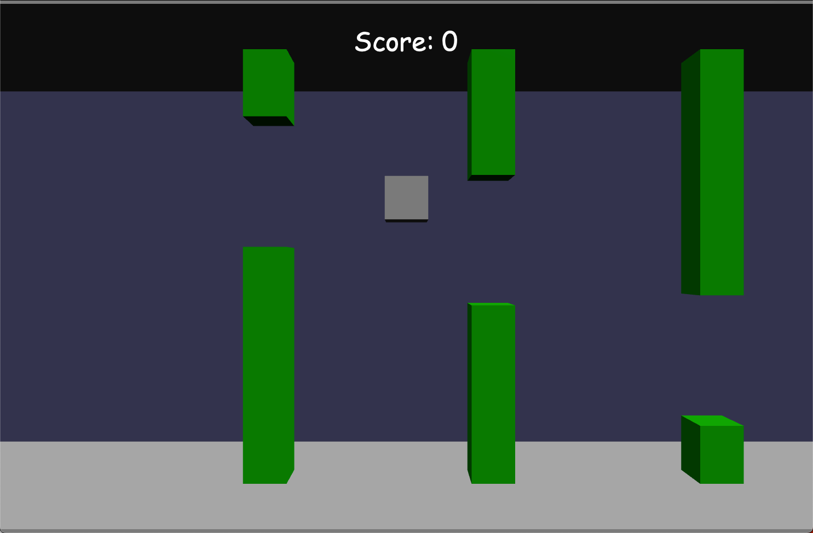

# Set up CubeFlyer

For this event, we have created a game project that attendees can contribute to to help them learn how to contribute to open source projects. This game is based off Flappy Bird, and is written in JavaScript using a game framework called [BabylonJS](https://www.babylonjs.com). The structure of the game is designed to be as easy to understand as possible, so that attendees with some programing experience will be able to make contributions, even if they have not used JavaScript before.

To run this game you don't need to install anything - it works as a static site, meaning that you can open the `index.html` file in any browser and play the game without having to install any JavaScript runtimes or packages.

## Create the CubeFlyer repository

When you run this event, you will need a 'golden source' version of the game that changes can be made to. This will need to be owned and maintained by an event organizer or mentor so that PRs can be raised and merged during this event. This repository will also need issues raised against it to give the attendees items to work on.

### Initial setup

To make it simpler to create this repo, we have provided a template repository that will create the CubeFlyer repo for you, along with creating the issues automatically.

To create your repo:

1. Navigate to [github.com/open-source-bootcamp/CubeFlyer](https://github.com/open-source-bootcamp/CubeFlyer)

1. Select the **Use this template** button

    

1. From the drop down, select **Create a new repository**

    

1. From the Create a new repository from CubeFlyer form, select the owner for the repository. Set this to public so attendees can access it, then select **Create repository from template**.

    

2. After a few seconds the repository will be created. Once create a GitHub Action will be run to create an initial set of issues for the attendees to work on during the event.

    

### Day 2

For the second day of the event, you will need additional issues opened to guide the attendees into forming teams to work on larger contributions depending on their area of expertise. Once again, we have created a GitHub action to create these issues automatically.

> Only create these after day 1 has been completed, to avoid confusing the attendees during day 1

1. Select the **Actions** tab

    

1. Select the **Create issues for day 2 on demand** action from the sidebar

    

1. This action will not have been run yet, so should show no runs yet. Select **Run workflow**, then  **Run workflow** from the drop down.

    

1. You can see the action running in the Actions tab.

    

1. Once the action is complete, there will be more issues created.

    

## Play CubeFlyer

Despite its simplicity, CubeFlyer is a tricky game! The goal is to fly your cube as far as possible, avoiding the floor, ceiling, and the barriers. If you hit any of these then it's game over!

CubeFlyer can be played with a keyboard or Xbox controller (including the [Adaptive controller](https://www.xbox.com/accessories/controllers/xbox-adaptive-controller). You only need to use one button to control the Cube, the fly button. Tap this to lift the cube up, and gravity will bring it back down again.

The fly button is:

* The space bar on a keyboard
* Any button on an Xbox controller

